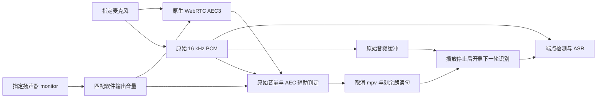

# AEC 人声保护与连续音频会话

## 状态

已实现原生插件、文件重放工具、TS 持续会话、参考音量跟踪和可选声学打断。
后续已改为双路识别保护：ASR 始终使用原始麦克风，AEC 仅辅助插话检测；新架构仍待实机验收。
默认配置不启用 AEC；没有 `aec` 时继续使用半双工路径。新增配置也不会在 Host 启动时打开麦克风，
只有用户点击“开始说话”才建立会话。

2026-09-26：已有实机录音的离线三段对照中，用户确认**线性消除和加强人声保护清楚，默认处理不清楚**。
候选参数在这些旧样本上改善了“数据库”的可懂度。随后新插件实机复测中，用户仍反馈含糊/缺字，
纯回声输出也产生错误转写，**该候选未通过实机验收，不建议启用**。应用持续会话的真人声学打断验收尚未开展。
完整历史与指标见 [麦克风验收](MICROPHONE_AEC_ACCEPTANCE.md)。

## 边界与数据流



- `packages/domain/src/barge-in.ts`：不可变、纯函数判定，在有界时间窗累计证据，允许短暂字间停顿。
- `packages/domain/src/voice-buffer.ts`：只保存原始帧，冻结插话开头、衔接后续帧、限制容量；消费后不可重复取用。
- `packages/domain/src/audio-timing.ts`：时间与连续性诊断的纯汇总；明确区分传输序号缺口、元数据不连续和时钟异常指标。
- `packages/adapters/src/aec-session.ts`：设备、进程、PCM 和会话生命周期；单个会话贯穿连续对话，
  避免每句重建 AEC 后重新收敛。生成、合成、播放期间持续采集，但只有当前识别轮次会提交 ASR。
- `apps/host/src/voice.ts`：代次和取消控制；插话仅中断当前播报，Host 结束当前回复流程后开启下一轮识别。
  不以插话自动授权任何工具，也不重新执行已经完成的 Codex 操作。
- `native/aec/`：PipeWire SPA WebRTC 插件小补丁，暴露 AEC3 人声保护参数和可选线性输出。
  不修改系统 PipeWire，不增加 Python 依赖。
- `native/aec/capture.c`：同一进程采集原始、AEC、扬声器 monitor 三路，附带 PipeWire 时间元数据。
  非实时主循环内使用非阻塞管道和 256 KiB 有界队列；拥塞溢出报错退出，不静默丢帧。
  `packages/adapters/src/audio-tap.ts` 校验二进制边界并拆包；采集助手不做语音业务决策。

持续保存最近 **1500 ms 原始 PCM**，覆盖轻声开头先于有效插话证据出现的情况；
支持的确认时长范围内均保留此长度。触发插话时冻结开头并保留停止播放器期间的后续样本，
总缓冲上限 **2910 ms**。增加预留长度不会延迟停止播报，但可能保留更多开头残余回声；
检测延迟超过预留范围时仍可能截断，不宣称覆盖任意迟触发。
若衔接超时则关闭会话并报错，避免提交被截断的插话。正常应用不写录音文件。
播放器退出后衔接原始帧，不重新打开麦克风，不拼接被抑制的 AEC 音频。没有播报的单次/连续识别也使用原始帧。
原始缓冲可能包含最后一小段外放回声；来自其他播放器的声音也可能进入 ASR，必须单独验证残余回声影响。
单次模式在录音结束后关闭会话，再做 ASR；连续模式直到用户停止、最后一个 UI 断开或音频故障才关闭。
界面会提示连续 AEC 会话保持麦克风开启。

## 构建与配置

```sh
# 未提交的新文件也纳入构建；提交后可使用 nix build .#aec-plugin
nix build path:.#aec-plugin --out-link /path/to/aec-package
pnpm check
pnpm build
```

由 `flake.lock` 固定 nixpkgs、PipeWire **1.6.5** 源码和 WebRTC Audio Processing **2.1** 源码/库。
使用内部 AEC3 类型，因此升级 WebRTC 必须重新构建并复测；不跨版本复用二进制。
包提供 `voidmaker-aec-pw-cli`，以固定的 SPA 搜索路径加载 `aec/libspa-aec-voidmaker`，
保留固定版本的基础 SPA 插件。已在本机 PipeWire 服务 **1.6.6** 上通过虚拟设备集成验证。
`library.name` 接受插件名称，不能直接填 `.so` 绝对路径。
双路实现还需要同一构建产物中的 `bin/voidmaker-audio-capture`，升级时应整体更新包。

将下面字段合并进仓库外的 `voice.json`，保留已有 `asr` / `tts`。节点必须使用 **node.name**。
`pluginDirectory` 应指向构建产物的 `lib/spa-0.2`，使用长期保留的 Nix store 路径或 GC root。

```json
{
  "inputTarget": "实际麦克风 node.name",
  "aec": {
    "pluginDirectory": "/path/to/aec-package/lib/spa-0.2",
    "outputTarget": "实际扬声器 node.name",
    "settings": {
      "nearendSnr": 3,
      "nearendEnr": 1,
      "nearendTrigger": 1,
      "nearendHold": 125,
      "nearendInitial": true,
      "initialSeconds": 2.5,
      "nearendTransparency": 4
    },
    "bargeIn": false,
    "confirmationMs": 300,
    "threshold": 0.015,
    "referenceRatio": 3
  }
}
```

上面的配置仅供继续诊断；该候选本轮实机验收失败。`settings` 整体省略时应用采用上述人声保护候选；
显式传入部分 settings 时，缺失字段采用固定上游默认值。
工具 `aec:replay` / `aec:smoke` 的 `--settings` 缺省为上游基线，便于对照；测试候选必须显式传参。
`nearendTransparency` 放宽 near-end 分支的 LF/HF 抑制掩码，范围 1–8；数值更大可能保留更多回声，
不能仅按人声响度选择。`nearendInitial=true` 本来就是此固定版本的默认值。

`bargeIn` 默认关闭。准备进行交互验收时设为 `true`、重启 Host，然后由用户启动连续对话。
TTS 强制输出到指定扬声器；采集流禁止回退到默认设备。
每 250 ms 核对设备身份与音量；音量改变时同步参考增益，并暂停打断判定 500 ms、清除旧的滚动缓冲。
设备消失、静音、非等声道软件音量或无法验证参考缩放时关闭会话并提示；不推断硬件音量。

当前打断是能量与参考幅度启发式，不是神经 VAD。默认在 450 ms 窗口中累积 300 ms 证据：
原始能量达到 0.015、超过参考 6 倍，且 AEC 能量达到 0.0075 并超过参考 3 倍；
原始能量超过参考 12 倍时，可在 AEC 严重抑制人声的情况下提供证据。
窗口长度为 `confirmationMs + 150 ms`，不能无限累积零散噪声。
原始/参考数据超过 150 ms 未更新、音量变化稳定期或原始/AEC 图延迟差超过 300 ms 时清空判定证据。
任一路停止输出、帧损坏、传输不连续或 IPC 积压超过 500 ms 时关闭整个会话。
弱声、说话间隙、键盘声和音乐仍需专门验收；不保证任意环境中的误触发率。
线性输出仅用于诊断，没有直接用作生产 ASR 输入，以免放大残余回声。

## 验证与诊断

```sh
# 真正加载原生插件与 PipeWire，但只连接自动创建的虚拟 source/null sink，不开启麦克风
VOIDMAKER_AEC_SMOKE=1 VOIDMAKER_AEC_PACKAGE=/path/to/aec-package \
  pnpm test tests/aec-native.test.ts tests/aec-session.test.ts

# 文件重放，不连接 PipeWire 或设备；目录必须不存在
pnpm aec:replay --package /path/to/aec-package \
  --internal /private/internal.wav --directory /private/new-replay \
  --settings '{"nearendSnr":3,"nearendEnr":1,"nearendTrigger":1,"nearendHold":125,"nearendTransparency":4}'
```

内部录音须为 PipeWire 48 kHz float32 三声道（参考、capture、最终输出），按完整 10 ms 帧读取。
导出 capture / linear / final，linear 为 16 kHz，其余为 48 kHz；文件为 0600、目录为 0700，拒绝覆盖。
工具保留浮点样本和 PCM16 WAV 衍生文件，做 ASR 前按模型契约重采样。
同时写入 `statistics.jsonl`，每秒记录 APM 的 delay / ERL / ERLE 内部统计；缺失值用 -1 表示。
这些内部估计不能代替录音实测衰减或听感，也不能把 delay=0 解释为物理链路零延迟。
统计中的 `monotonicMs` 与采集助手的单调时钟属于同一时钟域；`seconds` 是已处理音频时长。
线性导出会执行同步文件 I/O，仅用于有意识开启的诊断；生产会话不启用导出。

`pnpm aec:smoke` 新增 `--plugin-directory` 和 `--settings`；配合 `--debug-audio` 可同时导出线性阶段。
此命令会录制指定设备，**必须在用户准备好后运行**，详见麦克风验收文档。

### 双路会话诊断

```sh
# 诊断配置在仓库外，包含显式 inputTarget 和 aec；不必修改正在运行的 Host 配置。
# 会打开所指定的输入设备，必须有人值守并准备好。
pnpm aec:session-smoke --confirm-microphone --config /private/diagnostic-voice.json \
  --directory /private/new-session --seconds 20
# 可加 --reference /private/reference.wav：播放参考音频，检测插话后停止，导出原始识别片段。
```

输出 `raw.wav` / `clean.wav` / `reference.wav`、`timing.jsonl`、`report.json`、
`linear.f32` 和 `aec-statistics.jsonl`。发生插话且捕获成功时另写 `recognition.wav`。
全部保存在指定私有目录，不调用 ASR/Codex，不修改 Host 配置；失败/取消同样关闭采集并记录失败原因。

时间线记录每路传输序号、可用时的 PTS/元数据序号、buffer cycle 时间、采集回调时间、
图时钟 ticks/rate、设备/滤波延迟、重采样缓冲和排队 buffer 数。PTS 缺失明确表示为 null。
**回调时间不是硬件采样时刻，三路 WAV 的起点不保证同步**；共同单调时钟用于诊断，不能假定信号已经对齐。
图时钟异常计数是排查指标，不等于已确认的硬件丢帧数。传输数据缺口和 PipeWire 明确标记的损坏则会中止会话。

待修复和验收：新插件的纯回声抑制/双讲清晰度，新的仅人声测试、连续对话中实际停止播报及插话开头保留、
音量改变、真实设备断开、不同距离和音量、长时间运行与误触发。

2026-09-26 22:14 双路实机诊断已验证实际停止播报，用户确认停止迅速；但本轮默认 800 ms 端点等待
在约 930 ms 的句内停顿处提前结束，识别只保留“停止播报”。原始录音的后半句完整。
独立诊断配置改用现有 `vad.silenceMs=1000`；同一录音重放保留完整第一句，本地 ASR CER 0/13，
当时待真人复测。该次纯回声测试中发生音量变化，未触发不代表固定音量验收已通过。
随后 22:23 固定音量纯回声短样本未触发；双讲端点保住后半句，但较晚触发使原有 600 ms 缓冲丢失开头。
因此预留扩大至上述 1500 ms；同次录音重放保留整句、CER 0/13，扩大缓冲后的真人验收仍待完成。
底层线性 AEC 仍未收敛。
