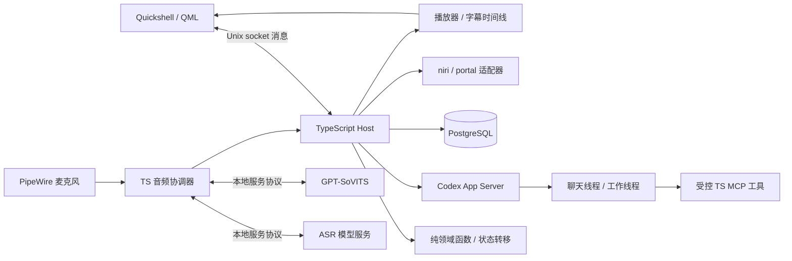

# VoidMaker AI 语音助手全面重构计划

> 修订日期：2026-09-26。目标环境：NixOS + niri + Quickshell。本文保留目标架构与分阶段实施历史；最新状态与剩余范围见 [整体未完成项](REMAINING_WORK.md)。第 8 节早期记录中的限制需结合后续验收阅读。

## 1. 重构决策

VoidMaker 将以 [Amadeus 的 Talk / Embody / Act / Control](https://github.com/Code-Amadeus/Amadeus#what-amadeus-is-trying-to-solve) 为功能参考，重建为本机运行的 AI 语音助手。参考的是用户能力和责任划分，不复制其 Windows、Electron 或 Python Host 实现。

本计划采用以下明确约束：

1. **新 UI 直接重做**：Quickshell/QML 是唯一桌面界面。旧 PySide6 窗口、隐藏 `PetWindow` 控制器和旧桥协议无需维护或兼容。
2. **只接 Codex**：聊天和后台工作都由 Codex App Server 驱动；删除 Claude Agent SDK 和双后端配置。两类任务使用独立的线程、工具范围和权限策略。
3. **PostgreSQL 是唯一持久化数据库**：会话、任务、审批、记忆索引和产物元数据统一写入 PostgreSQL；不建设 SQLite 或 JSONL 双写路径。
4. **TypeScript 承担应用逻辑**：主服务、音频编排、Codex 客户端、任务调度、桌面适配器、管理接口均用 TypeScript。Python 仅允许存在于确实需要它的本地 ASR/TTS 模型服务中，与主服务通过版本化协议通信。
5. **函数式与声明式优先**：领域规则写为纯函数、不可变数据和穷尽匹配；QML 只声明视图与用户意图；数据库、进程、音频设备等副作用收束在适配器层。拒绝以继承 UI 控件来承载业务状态。
6. **兼容性优先级低**：先实现干净的新系统。旧配置、历史与角色包可以按需提供一次性导入工具，但不阻碍删除旧运行时、旧 schema 和旧 UI。

## 2. 功能范围与现状差距

下表是制定计划时的旧 Python 应用现状，不是当前 TypeScript 实现状态；参考能力来自 [Amadeus README](https://github.com/Code-Amadeus/Amadeus#current-capabilities) 和 [架构说明](https://github.com/Code-Amadeus/Amadeus/blob/main/ARCHITECTURE.md)。目标中的部分能力现已完成，见最新状态清单。

| 用户能力 | 当前实现 | 重构目标 |
| --- | --- | --- |
| 文字与角色对话 | Python Claude/Codex 双后端、角色卡、分段回复 | TypeScript Host + Codex App Server；显式会话、轮次、结构化事件和可取消生成 |
| 语音输入 | `pw-record`、能量 VAD、Whisper 系列；连续对话为半双工 | PipeWire 采集 + 独立本地 ASR 服务；可编辑转写、连续对话、设备与错误状态可见 |
| ASR 质量 | faster-whisper CPU / whisper.cpp Vulkan | 选用 Qwen3-ASR-0.6B；在目标机器上验收识别质量和时延，无 Whisper 回退 |
| 合成与播放 | Python 调外部 GPT-SoVITS，mpv 播放 | TypeScript 控制外部 TTS 与播放器；统一播放时钟、字幕、口型、停止和错误回收 |
| 打断 | 暂停拾音防回授，缺统一取消链路 | 首先提供停止键与半双工可靠取消；通过 AEC/VAD 实测后支持说话时插话 |
| 角色表现 | 静态立绘、字幕和语气参考音 | Quickshell 声明式状态视图；实际 PCM 播放驱动口型、表情和字幕时间线 |
| 桌面感知 | niri 窗口、截图、剪贴板、播放状态 | TypeScript 适配 niri/Wayland/portal；用户可见的范围和授权；支持主动观察开关 |
| 工作执行 | Agent 工具调用和 Codex 后端，无独立任务账本 | Codex 工作线程、任务状态、审批、进度、取消、重试、恢复和产物注册 |
| 长期信息 | JSONL 历史、文件记忆、记事本 | PostgreSQL 中可查询、可修订、可删除的会话、项目、记忆与任务元数据 |
| 设置与诊断 | TOML、Python localhost 管理页、托盘 | TypeScript 配置与本地管理入口；显示 Codex、ASR、TTS、数据库、设备健康状态 |

第一版完整用户旅程：按键或点击开始说话 → 本地 ASR 转写并允许更正 → Codex 回复并由角色朗读 → 用户随时停止/改口 → 语音委托工作 → 查看审批、进度和产物 → 重启后继续查看任务。唤醒词、复杂动画和应用会话协议在该旅程稳定后考虑。

**明确不移植**：Electron/React、Win32/WorkerW/Lively 壁纸、CUDA cu124 配置、Amadeus 的 SpriteForge/PixiJS、VN Player。旧 PySide6 UI、Claude SDK、Whisper 主路径和 Python 应用 Host 会在切换后移除。

## 3. ASR 选型：Qwen3-ASR-0.6B

用户已明确选用 **Qwen3-ASR-0.6B**，作为当前唯一计划部署的 ASR 模型。以下候选表保留为选型背景，其他模型不属于本阶段必做项。

ASR 以本地服务形式部署，TypeScript 只使用统一的 `transcribe` / `stream` 协议；模型推理可以是 Python、C++ 或其他独立运行时。服务仅绑定本机，模型权重不进仓库。

| 候选 | 适用点 | 实施注意 |
| --- | --- | --- |
| [Qwen3-ASR 0.6B / 1.7B](https://github.com/QwenLM/Qwen3-ASR) | 中文、英文、日文和混合语音的优先质量候选；官方提供离线与流式能力 | 官方当前流式推理实现依赖 vLLM 后端；NixOS/ROCm 可行性、显存和首字延迟须实测，不能仅凭模型榜单定默认 |
| [Paraformer 中文流式模型](https://github.com/modelscope/FunASR/blob/main/model_zoo/readme_zh.md) | 低延迟实时字幕候选，可比较热词/专名表现 | 流式与离线模型是不同契约；需实测端点检测、标点、断句与长句质量 |
| [SenseVoiceSmall](https://github.com/QwenAudio/SenseVoice) | 中文及多语种对话候选，兼具情感/音频事件标签 | 评估 CPU/GPU 推理速度与本机部署方式；情感标签不能直接当作角色表情事实 |

阶段 0 录制经用户许可的测试集，覆盖普通话口语、中英日混说、角色名/项目名、远场、键盘声、扬声器回声和静音。至少记录字符错误率、专名命中率、首个稳定转写延迟、句末延迟、实时系数、显存/内存和失败率。用现有 Whisper 结果作比较基线，但不保留它作为新系统的自动回退。当前默认模型已经确定，同机评测用于验收质量、延迟与资源占用；如离线质量与流式延迟难兼得，可选“流式草稿 + 句末高质量复核”，但只有在实测确有收益时才引入双模型。

## 4. 目标技术栈

| 组成 | 目标选型 | 边界 |
| --- | --- | --- |
| 运行环境 | Nix flake 锁定 Node.js LTS、pnpm、Quickshell、PipeWire 工具、PostgreSQL 客户端与桌面工具 | `pnpm-lock.yaml` 锁定 TS 依赖；本地模型服务有独立环境和锁文件 |
| 主服务 | Node.js + TypeScript，`strict`、ESM | 不依赖 Qt 或 Python；作为独立 `systemd --user` 服务运行 |
| UI | Quickshell/QML，组件化声明式绑定 | 仅显示状态并提交意图；不在 QML 中实现会话、权限或任务规则 |
| UI 通信 | `$XDG_RUNTIME_DIR/voidmaker/host.sock` 上的 Unix socket + JSON lines | Quickshell 的 [Socket](https://quickshell.org/docs/v0.3.1/types/Quickshell.Io/Socket/) 可直连；Host 与 UI 生命周期分离 |
| Codex | `codex app-server` 的本地 stdio JSON-RPC，由 TypeScript 管理子进程 | [官方 App Server 文档](https://learn.chatgpt.com/docs/app-server)覆盖线程、事件、审批和 `turn/interrupt`；使用固定 CLI 版本生成匹配的 TS schema |
| 工具扩展 | 必要时使用 TypeScript MCP SDK 暴露经 Host 授权的本地能力 | 对话线程只有受限能力；工作线程按项目与审批策略开放更高权限；不依赖实验性动态工具协议 |
| 音频 | PipeWire 采集；外部 GPT-SoVITS TTS；受控播放器进程，必要时换原生 PipeWire 播放 | 音频控制、取消、时间线在 TS；模型推理留在隔离服务 |
| 数据库 | PostgreSQL + `pg` 驱动 + Drizzle schema/migrations | 专用本地数据库角色、事务、约束与版本化迁移；不开放远程数据库监听 |
| 配置/协议 | Zod 边界校验，版本化消息 schema；本地配置文件保存非密钥设置 | 命令、事件、模型服务响应均校验；敏感凭据由 Codex/服务自身或受限用户配置管理 |
| 验证 | Vitest（纯领域测试、协议/数据库集成测试）、`tsc --noEmit`、Biome、Quickshell 实机验收 | 用 PostgreSQL 临时测试实例验证事务和恢复；不以 mock 证明设备音频可用 |

PostgreSQL 在 NixOS 上作为本机系统服务配置，Host 通过 Unix socket 或回环地址连接。数据库不可用时明确报告不可用，不隐式切换到文件数据库。可选管理 HTTP 端点仅绑定 `127.0.0.1`；普通 UI 与 CLI 使用 Unix socket。

## 5. 架构与代码组织



建议目录：

```text
apps/host/                 # systemd 用户服务入口、音频与 Codex 进程管理
apps/shell/                # Quickshell QML 组件、主题、视图状态
packages/domain/           # 纯状态转移、权限决策、任务规则
packages/contracts/        # Zod schema、命令/事件/模型服务协议
packages/adapters/         # PostgreSQL、PipeWire、niri、Codex、ASR/TTS
db/migrations/             # 可审查的 PostgreSQL 迁移
tests/                     # 领域、契约、集成与设备验收脚本
```

领域核心采用 `transition(state, event) -> { state, effects }`。`state` 与 `event` 是判别联合类型；转移函数不得读时钟、访问数据库、启动进程或改写输入。Host 执行返回的 effects，再将成功或失败作为新事件送回领域核心。异步取消使用 `AbortSignal`，轮次与任务都带代数/ID；所有可持久事实先经 PostgreSQL 事务提交，再广播给 UI。QML 用属性绑定渲染投影，不直接修改领域状态。

### 5.1 Codex 与权限

对话与工作使用独立的 Codex App Server 进程及线程，以隔离 MCP 配置、工作目录和沙箱权限。对话线程以角色交互为主，限定读取范围；工作线程绑定明确的 Project 工作目录、沙箱、审批策略和工具集合。Host 保存 Codex `threadId` / `turnId`、任务 ID、用户授权和结果事实；Codex 自身保留其会话内部状态。Host 不根据模型叙述推断文件已写入或操作已完成，必须读取 Codex 事件与产物校验结果。

Codex App Server 要完成 `initialize` / `initialized` 握手，解析流式通知并响应审批请求。用户打断时先使当前轮次失效，调用 `turn/interrupt`，停止 TTS/播放并清理待发送的语音输入；晚到事件因轮次 ID 不匹配被忽略。工作取消只中断 Attempt，已发生副作用不会被标成“已回滚”。App Server 的[官方协议说明](https://learn.chatgpt.com/docs/app-server)支持线程恢复、结构化通知和中断；具体字段以固定版本生成的 schema 为准。

### 5.2 PostgreSQL 事实模型

首版表：`sessions`、`messages`、`projects`、`work_items`、`attempts`、`work_events`、`permission_requests`、`artifacts`、`memories`。每条外部动作有任务/轮次关联、状态、时间戳和幂等键。工作状态至少区分 `queued`、`running`、`awaiting_permission`、`completed`、`failed`、`cancelled`、`interrupted`。重启后将不确定的运行中 Attempt 标为 `interrupted`，用户确认后才继续或重试。

产物表保存 Project 归属、规范化路径、类型和摘要；注册时校验路径处于授权工作目录内。聊天记录保存用户可见内容及来源，不把原始录音、截图或模型权重写进数据库。记忆要能在 UI 中查看、修订、删除和按项目/角色限定作用域。所有 schema 改动配向前迁移；旧 JSONL 文件可留作用户手动归档，不做永久双写。

### 5.3 语音时间线

语音状态为 `idle → listening → transcribing → thinking → speaking`，并显式表示 `error`、`cancelled`、设备缺失及服务预热。采集 PCM、ASR 部分结果、最终转写、Codex 文字段、TTS PCM、播放器实际进度均带 `session_id`、`turn_id`、`segment_id`。字幕和口型以播放位置而非“合成完成”事件驱动。麦克风、扬声器、ASR 或 TTS 故障需返回可操作状态，文字对话继续可用。

初版保持可靠半双工，并提供停止按钮和快捷键。声学插话需通过 [PipeWire echo-cancel](https://pipewire.pages.freedesktop.org/pipewire/page_module_echo_cancel.html) 与 VAD 的扬声器/耳机实测；未通过则继续半双工。唤醒词默认关闭，作为独立可选功能交付。

## 6. 分阶段实施与验收

### 阶段 0：评测与架构基线

- 固定目标机器的 niri、Quickshell、PipeWire、GPU 和 PostgreSQL 环境记录；建立 ASR 测试集和同机评测脚本。
- 产出协议 schema、领域状态图、数据库草图、Codex App Server 最小 TS 连接原型。
- **验收**：Qwen3-ASR-0.6B 具备可重复的本机推理路径与实测指标，写明未达标项；其他模型的对照评测为可选项。

### 阶段 1：TypeScript 核心与新 Quickshell UI

- 建立 TS 工作区、纯领域核心、PostgreSQL 迁移、Unix socket 协议和 `systemd --user` 服务；新 QML 实现输入、消息、状态和连接恢复。
- 接通 Codex 聊天线程、文字流、审批与中断。直接切换新入口，不在旧 `PetWindow` 上叠加功能。
- **验收**：新 UI 完成文字对话；断开/重启 UI 后恢复会话快照；数据库重启后消息可见；Codex 生成中可停止且无旧事件串入。

### 阶段 2：本地语音闭环

- TypeScript 完成 PipeWire 采集、VAD 编排、选定 ASR 适配器、GPT-SoVITS 客户端、播放控制、字幕和音量/口型事件。
- 一次性语音与半双工连续对话共用同一状态机；转写可编辑，语音服务故障不阻断文字对话。
- **验收**：语音提出问题并听到回答；生成、合成、播放三个阶段均可立即停止；再次说话没有上一轮残留声音、字幕或转写。

### 阶段 3：后台工作与可恢复事实

- 实现 Codex 工作线程、Project/Draft、WorkItem/Attempt、权限、任务事件、产物校验与新 UI 的工作视图。
- **验收**：语音委托真实任务后能查看进度、批准/拒绝操作和打开产物；Host 异常退出后任务显示 `interrupted`，不会暗中重放副作用。

### 阶段 4：桌面感知与主动能力

- 用 TS 接入 niri IPC、截图/portal、当前窗口/媒体；实现主动观察的时间与隐私限制、用户可撤销的权限。
- **验收**：截图与桌面信息来源可见；拒绝授权后不访问对应输入；无 portal 或截图工具时清楚降级。

### 阶段 5：声学插话与可选扩展

- 实测并按结果加入 AEC+VAD 插话；再评估唤醒词、额外 ASR/TTS 适配器、复杂角色动画和应用交互协议。
- **验收**：助手播放时用户插话能停止旧轮次；扬声器回采不会反复自触发；设备切换及模型服务退出可恢复。未达到设备验收标准的功能保持可选，不成为主链路依赖。

### 阶段 6：清理与发布

- 删除 Python 应用 Host、Claude SDK、旧 UI/桥、Whisper 默认路径和过时文档/依赖；保留确有需要的独立模型服务脚本。
- 更新 Nix flake、锁文件、安装和服务配置，记录 PostgreSQL 初始化、备份/恢复和角色资产安装步骤。
- **验收**：干净 NixOS+niri 环境按文档部署；`pnpm` 检查与测试、数据库迁移和完整语音/工作实机旅程通过；主应用无 Python 运行时依赖。

## 7. 关键风险与交付规则

| 风险 | 处理规则 |
| --- | --- |
| Qwen3-ASR 流式服务在目标 GPU 上不可用或过慢 | 先验证 Qwen3-ASR-0.6B 的离线半双工路径，按实测调整后端与资源配置；更换模型需重新评估 |
| Codex 用作角色聊天时延迟或费用较高 | 测量首字/整轮延迟、token 用量与缓存行为；优化上下文和分段策略，不私自增加第二个 Agent 后端 |
| Quickshell/Host 连接断开 | Host 独立运行；UI 重连请求数据库快照和事件游标，显示明确离线状态 |
| PostgreSQL 不可用 | 主服务拒绝写入与工作执行并报告数据库状态；使用本机受限角色和定期备份，不写隐式文件回退 |
| TS 与 QML 两种语言造成状态漂移 | 领域状态只在 TS；QML 仅用版本化投影和纯展示绑定，协议由契约测试覆盖 |
| 音频回声与播放时钟不准 | 半双工先上线；口型基于实际 PCM/播放进度；必要时替换播放器适配器，不改领域契约 |
| 引入参考代码和角色资产 | Amadeus 第一方代码使用 [AGPL-3.0](https://github.com/Code-Amadeus/Amadeus/blob/main/LICENSE)，资产另有权利边界。按功能重新实现；若直接复制代码，先确定发布许可与来源义务；资产和权重不入库 |

每阶段以可运行用户旅程、失败路径和真实设备结果验收。当前分支已开始落地 Codex TS 链路，
阶段 0 的 ASR 同机评测仍待执行；用户已确定选用 Qwen3-ASR-0.6B。

## 8. 实施记录（2026-09-26）

已建立 TypeScript 工作区、新 Quickshell 面板、Unix socket 通信、PostgreSQL 消息/会话迁移、
Codex App Server 客户端与纯函数对话状态机。已实测文字流式回复、停止后再次对话、Host 重启历史恢复，
并验证 QML 可在当前桌面加载。新增协议和数据库回归测试，Nix 开发环境改为 TS 工具栈。

首次实施完成阶段 1 的基础文字链路。ASR 同机评测尚未开展；持久审批/任务账本、角色表现、桌面感知和
旧实现清理继续按后续阶段推进。旧 Python 代码暂留作功能参考，不是新应用的运行依赖。

本轮验证：`pnpm check`、`pnpm build`、Ruff 通过；启用真实 PostgreSQL 集成测试后，
3 个测试文件共 6 项测试通过。Codex 适配器测试覆盖最终回复/过程消息分离、启动期间取消、
子进程异常和字符串 RPC ID 的审批响应。编译后的 Host 已验证启动与历史快照恢复。

当前限制：单会话、最近 200 条历史、内存审批（60 秒超时拒绝）；尚未实现事件游标与持久任务账本，
Codex 子进程异常后需要重启 Host。聊天目录已独立到 XDG state 目录，继续使用用户的 Codex 登录与全局配置。

### 阶段 2：语音工程链路（等待模型与设备验收）

已接入 TS PipeWire 录音、能量端点检测、显式本地 ASR transcription API、GPT-SoVITS 非流式分句合成和 mpv 播放。
新增可编辑转写、半双工连续模式、进度/PCM 音量事件及全阶段取消；异步事件通过 generation 丢弃过期结果。
UI 协议升级至 v2，新增 VoiceControls 声明式组件；无语音配置时保留文字对话。

新增同机评测工具，输出 CER、专名召回率、RTF、延迟和失败率；没有录音样本或模型服务，因此没有编造评测结果。
该阶段开始时用户没有现成服务，先完成代码、自动测试与部署说明；当时已确定默认 ASR 为 Qwen3-ASR-0.6B，尚未部署模型、
验证真实说话/朗读、实现声学插话或角色口型。详见 [语音接入与验收](VOICE_SETUP.md)。

本轮验证：7 个测试文件共 24 项通过（包含 PostgreSQL 和实际 mpv 空输出），类型检查、构建、Ruff 通过。
编译后 Host 实测未配置 ASR 时明确报错，随后仍可完成真实 Codex 文字对话；新 QML 可加载。
ASR 评测 CLI 通过假 HTTP 服务跑通报告生成，测试报告已清理，不将该结果作为模型质量数据。

### 本地部署与现有音频实机验收

已部署 Qwen3-ASR-0.6B 的独立 Transformers/ROCm 服务，锁定模型 revision 与依赖；
ASR、TTS、PostgreSQL、Host 和 Quickshell 均由 systemd 用户服务管理并启用。
通过官方中文样本、混合语音合成样本与静音测试，完成真实 Codex 回复、扬声器播放、中断及再次对话。
用户确认播放清晰正常；原日语 TTS 权重的中文回环异常，当前改用通用预训练权重并保留原配置。

用户明确选择暂不录制麦克风，因此真人识别、VAD 和连续对话声学表现仍待验收，声学插话仍未实现。
量化结果、失败样本限制和服务操作见 [部署验收报告](DEPLOYMENT_ACCEPTANCE.md)。

### 阶段 3：持久后台任务

已实现项目与任务草稿、独立 Codex 工作进程、PostgreSQL 任务/执行/审批/事件/产物账本、
取消、显式重试、Host 重启中断恢复及 Quickshell 工作视图。IPC 升级为 v3。
任务审批持久化；聊天审批仍沿用阶段 1 的短期内存流程。

真实 Codex 已在临时项目生成并验证文本产物，耗时约 20.6 秒；进程级测试验证后台工作期间聊天、
取消、审批时异常退出、重启不重放及显式重试。用户的 `boot.tmp.useTmpfs` 已解决本机 Codex 的 Btrfs 沙箱启动错误。
真人语音委托继续等待之前延期的麦克风验收。操作、架构、数据边界与测试命令见 [后台任务说明](WORK_TASKS.md)。

### 阶段 4：桌面上下文与主动观察

已实现 niri 聚焦窗口、MPRIS 媒体、slurp + grim 手动框选预览及 Codex 图片输入，IPC 升级至 v4。
窗口、媒体和截图分别授予短期权限；可随时撤销，过期或 Host 重启后失效。PostgreSQL 保存策略与审计元数据。
主动观察默认关闭，只在授权、时段、界面活动和会话解锁等条件满足时调用独立 Codex 观察器。
普通聊天与观察器禁用执行工具，工作执行保留在后台任务流程中。

46 项测试及真实 grim / Codex 图片、合成上下文建议链路通过；正式服务已更新。
本阶段采用目标桌面可用的 Wayland 工具链，portal 回退和剪贴板读取暂未实现。
手动框选、活跃播放器、真实锁屏及建议质量仍待交互验收；详见 [桌面接入与验收](DESKTOP_CONTEXT.md)。

### 后续：交互验收与角色基础层

上述桌面交互、真人语音和可选双路插话已在后续完成受控验收，详情见各专项文档。
角色基础层已接入：新角色 schema、外置素材、Codex 角色指令、按角色/配置版本隔离的会话与线程、
可选参考声音覆盖、透明差分立绘和实际播放音量驱动的口型。统一协议为 v5，迁移为 0004。
代码和验证见 [角色说明](CHARACTERS.md)；未完成范围以 [当前清单](REMAINING_WORK.md) 为准。

### 2026-09-26 会话与记忆基础层

迁移 0005、协议 v6：多个角色内会话、分页历史搜索、归档恢复和手动记忆管理已实现。记忆修改通过事务使旧模型线程失效。当前验证及剩余边界见 [会话与记忆](SESSIONS_MEMORY.md)。
