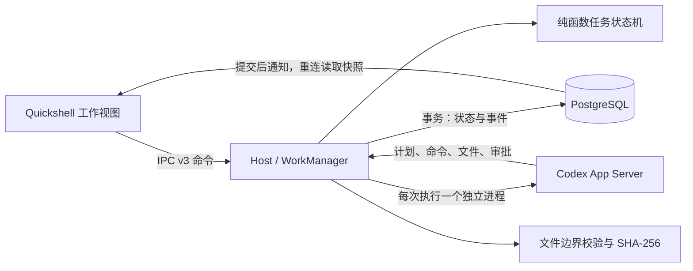

# 后台任务：使用、架构与验收

## 使用

1. 在「后台任务」页添加项目名称和绝对目录。保存的是规范化后的真实路径。
2. 输入任务，保存草稿；选中草稿后可修改，保存修改后点击「确认并执行」。
3. 语音委托使用一次性录音：转写完成后在对话输入框更正，点击「将输入转为任务草稿」，再选择项目并确认。
4. 执行过程中可继续聊天。任务页显示状态、计划、命令退出码、输出和审批请求。
5. 权限请求可「允许一次」或「拒绝」，两分钟未处理会过期并拒绝。UI 断线不丢失审批，重连可继续查看。
6. 产物在应用内预览；打开前再次核对路径和 SHA-256。历史文件若已变更，会提示与原产物不一致。
7. 取消保留已经发生的修改。失败、取消或中断后，检查项目文件，再点击「重试（新执行）」。

执行确认允许 Codex 在所选项目的 `workspace-write` 沙箱中操作；不是每条命令都会再次询问。
超出当前权限的请求由 Codex 转交 UI。任务执行不自动提交 Git、推送或发布，除非任务明确要求。

## 架构



- `packages/domain/src/work.ts`：状态转换规则，不访问数据库、网络或进程。
- `packages/contracts/src/work.ts`：IPC 命令、状态和投影类型。工作命令自 v3 引入；当前整体协议为 v7。
- `packages/adapters/src/work-store.ts`：参数化 PostgreSQL SQL、行锁、事务及调度器 advisory lock。
  任务账本使用显式 SQL，便于审查状态更新与事件写入的原子边界；迁移文件是数据库结构的来源。
- `apps/host/src/work.ts`：单后台执行槽、持久队列、审批计时器、进程生命周期、事件排序和产物登记。
- `packages/adapters/src/codex.ts`：stdio JSON-RPC；聊天仍为独立的只读线程，工作使用新进程和新线程。
- `apps/shell/WorkPanel.qml`：项目、草稿、执行、审批、历史与产物视图；状态由 Host 提供。

表：`projects`、`work_items`（包含草稿）、`work_attempts`、`work_events`、`work_approvals`、`work_artifacts`。
UUID 草稿 ID 与 revision 防止重复提交及过期编辑；Attempt ID 阻止旧执行的事件污染重试。
工作线程禁用插件、hooks、Apps、MCP、网络搜索与多 Agent；默认禁止工具联网，写入范围为项目目录。
登录与模型选择沿用用户 Codex 配置。权限与事件字段基于本机 Codex CLI 0.156.1 的生成 schema，
参考 [App Server 协议](https://learn.chatgpt.com/docs/app-server)和[配置参考](https://learn.chatgpt.com/docs/config-file/config-reference)。

## 中断与结果语义

- 状态和审计事件在同一事务内提交；审批决定持久化后才响应 Codex。数据库失败时停止工作进程。
- Host 重启将 `queued`、`running`、`awaiting_permission`、`cancelling` 标成 `interrupted`，过期未决审批。
  重启不自动重放排队任务或恢复旧 Codex 轮次；重试始终新建 Attempt。
- Codex 结构化结果包含 `outcome`、`summary`、`artifacts`。被阻断、格式错误或声明的产物未通过校验会标记失败。
  `completed` 表示执行正常结束且已声明产物通过文件校验，业务结果仍需用户检查。
- 产物来自实际文件变更事件及最终声明，Host 读取真实普通文件，检查符号链接/目录边界并计算哈希。
  删除的文件保留在事件中，不伪装为可打开产物。文件存在与哈希不等于证明业务逻辑正确。
- 正式运行使用 `systemd --user` 的 `KillMode=control-group`，确保 Host 异常退出/重启时清理整个工作进程组。
  直接 CLI 调试时不要用 `kill -9` 代替正常关闭；进程级回归使用受控假 Codex。

## 本机沙箱

本机曾遇到 Codex 0.156.1 在 Btrfs 上报 `cannot establish app-server socket mount isolation`。
用户启用 `boot.tmp.useTmpfs` 后，宿主 `/tmp` 为 tmpfs，直接 `codex sandbox ... -- true` 与真实文件任务均通过。
应用没有加入关闭沙箱或替换临时目录的绕行逻辑。Nix 开发环境显式包含 `bubblewrap`。
测试嵌套 Codex 沙箱时，上层沙箱可能隐藏其 socket 目录；应在宿主开发环境验收。

## 自动验证

```bash
nix develop
pnpm install --frozen-lockfile
pnpm check
pnpm build

# 按自己的 PostgreSQL socket/角色填写，必须是测试库。
export VOIDMAKER_TEST_DATABASE_URL='postgresql:///voidmaker_test?host=/path/to/socket'
export VOIDMAKER_HOST_TEST_DATABASE_URL='postgresql:///voidmaker_host_test?host=/path/to/socket'
VOIDMAKER_AUDIO_SMOKE=1 pnpm test

# 单独运行，不能与数据库测试共用同一个库并行执行；会使用真实 Codex。
pnpm work:smoke
```

两种测试库必须不同，且不允许指向生产库。数据库测试会恢复/修改任务状态；Host 测试会终止测试进程。
真实验收脚本只在 `/tmp/voidmaker-work-acceptance-*` 创建文件，并把报告写在该临时项目中；不启动麦克风。

## 验收记录（2026-09-26）

- 自动回归：9 个测试文件、36 项全部通过，覆盖状态转换、重复提交、旧执行隔离、审批过期、多请求、路径越界、取消、失败结果，
  包含实际 PostgreSQL、mpv 空输出以及真实 Host 进程 + 假 Codex 的 IPC 回归。
- Host IPC 回归：后台执行期间聊天可回复；取消后任务为 `cancelled`；等待审批时强制终止测试 Host，
  重启显示 `interrupted`、旧审批 `expired`；显式重试创建新 Attempt，拒绝审批正常持久化。
- 真实 Codex：在临时项目生成 `acceptance.txt` 并用 Node.js 检查内容，35 字节，约 20.6 秒；
  Host 独立读取并验证 SHA-256，命令退出码均为 0，无额外提权。
- Host 与 Quickshell 用户服务已启动，迁移和 IPC v3 加载正常；使用虚构任务的组件截图检查了任务选择、审批和事件布局。
- 本轮没有录制麦克风；真人语音委托、VAD 与连续对话的设备验收延续此前待办。

当前范围：按角色配置版本隔离聊天会话、一个后台执行槽；任务列表最近 100 项、详情最近 100 条事件（数据库保留完整记录）。
单文件校验上限 20 MiB，文本预览前 64 KiB，最多登记 100 个产物；二进制只显示元数据。
暂不包含任务搜索/分页、自动重放、Git worktree 自动隔离、桌面打开程序或联网工具扩展。
